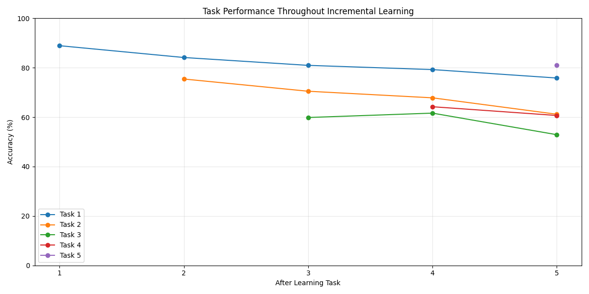

# Incremental Learning Learning for Traffic Sign Recognition

## Project Overview

This project implements an incremental learning system for traffic sign recognition using the German Traffic Sign Recognition Benchmark (GTSRB) dataset. The system addresses catastrophic forgetting—a major challenge in continual learning—through two complementary techniques: memory rehearsal and knowledge distillation.

## The Problem of Catastrophic Forgetting

Neural networks excel at learning new tasks but typically suffer from catastrophic forgetting when trained sequentially on different tasks. When a model learns new information, it tends to overwrite previously acquired knowledge, resulting in significantly degraded performance on earlier tasks.

## Dataset: German Traffic Sign Recognition Benchmark (GTSRB)

The GTSRB dataset contains 43 different classes of traffic signs with varying lighting conditions, perspectives, and occlusions. In this project, these 43 classes are divided into 5 sequential tasks to simulate a real-world scenario where traffic sign recognition systems must incrementally learn new sign categories.

## Solution Architecture

### CNN Model Structure

The model uses a convolutional neural network with:
- Three convolutional layers (32, 64, and 128 filters)
- Batch normalization after each convolutional layer
- Max pooling for dimensionality reduction
- Dropout (0.5) for regularization
- Two fully connected layers (512 units and 43 output classes)

### Memory Replay/Rehearsal

The first technique implemented to combat forgetting is memory replay:

```python
class MemoryBuffer:
    def __init__(self, buffer_size=200):
        self.buffer_size = buffer_size
        self.images = []
        self.labels = []
        
    def update(self, images, labels, per_class=20):
        unique_labels = torch.unique(labels)
        for label in unique_labels:
            indices = torch.where(labels == label)[0]
            selected = indices[:min(per_class, len(indices))]
            
            self.images.extend(images[selected].cpu())
            self.labels.extend(labels[selected].cpu())
            
        # Keep only buffer_size samples
        if len(self.images) > self.buffer_size:
            indices = random.sample(range(len(self.images)), self.buffer_size)
            self.images = [self.images[i] for i in indices]
            self.labels = [self.labels[i] for i in indices]
```

Key characteristics of the replay mechanism:
- Maintains a fixed-size memory buffer (200 samples)
- Stores a balanced set of examples per class (up to 20 samples per class)
- Randomly selects samples when buffer capacity is exceeded
- Integrates memory samples with current task data during training

### Knowledge Distillation

The second technique is knowledge distillation, which preserves the model's behavior on previously learned tasks:

```python
def distillation_loss(outputs, teacher_outputs, T=2.0):
    soft_targets = nn.functional.softmax(teacher_outputs / T, dim=1)
    soft_prob = nn.functional.log_softmax(outputs / T, dim=1)
    return nn.KLDivLoss(reduction='batchmean')(soft_prob, soft_targets) * (T * T)
```

In the training loop, this is implemented as:

```python
# Add knowledge distillation loss for old tasks
if current_task > 0:
    with torch.no_grad():
        teacher_outputs = old_model(combined_inputs)
    distill_loss = distillation_loss(outputs, teacher_outputs)
    loss = loss + 0.5 * distill_loss  # alpha=0.5 controls KD contribution
```

The distillation process:
1. Creates a copy of the current model as a "teacher" before learning a new task
2. Generates soft probability distributions from the teacher model
3. Encourages the updated model to produce similar outputs to the teacher
4. Balances classification accuracy with preserving knowledge of previous tasks

## Performance Evaluation

The system tracks performance using:
- Task-by-task accuracy matrix showing performance on all tasks after learning each new task
- Forgetting measurements that quantify knowledge degradation
- Visualization tools for both dataset characteristics and model performance

## Results and Insights

The combination of rehearsal and knowledge distillation effectively mitigates catastrophic forgetting. The accuracy matrix and forgetting measurements demonstrate how these techniques help maintain performance on earlier tasks while accommodating new knowledge.

The visualizations reveal:
- How performance evolves across sequential tasks
- Which classes/tasks are most susceptible to forgetting
- The effectiveness of the combined approach compared to using either technique alone




## Applications and Future Work

This approach to continual learning has practical applications in:
- Autonomous vehicles that must adapt to new traffic signs
- Smart city infrastructure with evolving signage regulations
- Any vision system that requires incremental updating


Future work could explore:
- Parameter-efficient fine-tuning to reduce memory requirements
- More sophisticated memory management strategies
- Integration with self-supervised learning for better feature representation
